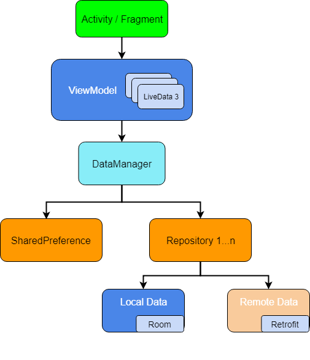
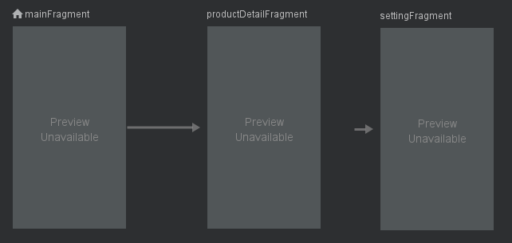

# mvvm-template
A template for quickly building a project that implements MVVM architecture using ViewModel,  Room, Dagger2, RxJava2, Data Binding, WorkManager, Navigation.

## Requirement:
* Android Studio 3.3+
* [Kotlin](https://github.com/my-jabin/mvvm-template) / Java

## Architecture
* Single-Activity-Multiple-Fragments

* MVVM architecture



## How to use it
1. Add/Modify the entities class. In the template, there is only a `Product` entity. Add your own entity. Then create a corresponding `Dao` and `Repository` class, add `Dao` to `AppDatabase` class.
2. Dependency injection:
    * Your activities need to be added in the `ActivityBuilder` class.
    * Your `ViewModel` class need to be added in the `ViewModelModule` class.
    * If any application associated dependencies is required, could be provided in the `AppModule` class
    * Any activity/fragment associated dependencies could be provided in the `xxxActivityModule` class or `xxxFragmentModule`
    * Binds your own `Worker` in the `WorkerBindingModule`, do not forget the Factory interface, see the example class `PrePopulateDataWorker`.
3. In this template, single-activity-multiple-fragments architecture is using in the whole project. If you use the same architecture, add your fragment in the `MainActivityModule` and create your `xxxFragmentModule`
4. Change the UI components.
5. Navigation graph:
  * Start destination is the `MainFragment`
  * One global action to `SettingFragment`




## Dagger 2
* `@Inject`: Basically with this annotation we request dependencies. In other words, you use it to tell Dagger that the annotated class or field wants to participate in dependency injection. Thus, Dagger will construct instances of this annotated classes and satisfy their dependencies.

* `@Module`: Modules are classes whose methods provide dependencies, so we define a class and annotate it with @Module, thus, Dagger will know where to find the dependencies in order to satisfy them when constructing class instances. One important feature of modules is that they have been designed to be partitioned and composed together (for instance we will see that in our apps we can have multiple composed modules).

* `@Provide`: Inside modules we define methods containing this annotation which tells Dagger how we want to construct and provide those mentioned dependencies.

* `@Component`: Components basically are injectors, let’s say a bridge between @Inject and @Module, which its main responsibility is to put both together. They just give you instances of all the types you defined, for example, we must annotate an interface with @Component and list all the @Modules that will compose that component, and if any of them is missing, we get errors at compile time. All the components are aware of the scope of dependencies it provides through its modules.

* `@Scope`: Scopes are very useful and Dagger 2 has has a more concrete way to do scoping through custom annotations. We will see an example later, but this is a very powerful feature, because as pointed out earlier, there is no need that every object knows about how to manage its own instances. An scope example would be a class with a custom @PerActivity annotation, so this object will live as long as our Activity is alive. In other words, we can define the granularity of your scopes (@PerFragment, @PerUser, etc).

* `@Qualifier`: We use this annotation when the type of class is insufficient to identify a dependency. For example in the case of Android, many times we need different types of context, so we might define a qualifier annotation @ForApplication and @ForActivity, thus when injecting a context we can use those qualifiers to tell Dagger which type of context we want to be provided.

---

In the `AppComponent` class
``` java
@Singleton
@Component(modules = {AndroidInjectionModule.class,
        AppModule.class,
        ActivityBuilder.class})
public interface AppComponent {

    @Component.Builder
    interface Builder {
        @BindsInstance
        Builder application(Application application);

        AppComponent build();
    }

    void inject(MvvmApp app);

}
```

* `AndroidInjectionModule`. The description of this module from official document is:
 ```
/**
 * Contains bindings to ensure the usability of {@code dagger.android} framework classes. This
 * module should be installed in the component that is used to inject the {@link
 * android.app.Application} class.
 */
```

* `ActivityBuilder` class is a customized module. We map all activities here, tell Dagger all of our activities in compile time

* `AppModule` class provides global dependencies. Like retrofit, okhttp, persitence db etc.

---

#### Map Multibindings

Dagger lets you use multibindings to contribute entries to an injectable map as long as the map keys are known at compile time.

To contribute an entry to a multibound map, add a method to a module that returns the value and is annotated with @IntoMap and with another custom annotation that specifies the map key for that entry.
``` java
@Module
public abstract class ViewModelModule {

    @Binds
    @IntoMap
    @ViewModelKey(SplashActivityViewModel.class)
    abstract ViewModel bindsSplashActivityViewModel(SplashActivityViewModel settingsActivityViewModel);

    @Binds
    @IntoMap
    @ViewModelKey(MainActivityViewModel.class)
    abstract ViewModel bindsMainActivityViewModel(MainActivityViewModel mainActivityViewModel);
}
```
In the above example, two `ViewModel` are added into a map with the structure `(Map<K, Provider<V>>).`, where key is a customized key annotated with `@ViewModelKey`, valus is a `Provider`
``` java
@Retention(RetentionPolicy.RUNTIME)
@MapKey
public @interface ViewModelKey {
    Class<? extends ViewModel> value();
}
```

Annotation `@Binds` is similar to `@Provides`. Simply put, the difference is `@Provides` return a concrete instance, while `@Binds` return an interface

---

#### Annotation `@ContributesAndroidInjector`
Dagger Android introduced an annotation which can reduce the `Component` `Binds` `IntoSet` `Subcomponent` `ActivityKey` `FragmentKey` etc. boilerplate for you.
``` java
@Module
public abstract class ActivityBuilder {
    // @ContributesAndroidInjector(modules = SplashActivityModule.class)
    // SplashActivityModule provides the dependencies specific to the SplashActivity
    @ContributesAndroidInjector()
    abstract SplashActivity bindsSplashActivity();

    // some other activity
}
```

`ActivityBuilder` tells Dagger all activities in the compile time. Using `@ContributesAndroidInjector`, Dagger generates automatically the following code for us.

``` java
@Module(subcomponents = ActivityBuilder_BindsSplashActivity.SplashActivitySubcomponent.class)
public abstract class ActivityBuilder_BindsSplashActivity {
  private ActivityBuilder_BindsSplashActivity() {}

  @Binds
  @IntoMap
  @ActivityKey(SplashActivity.class)
  abstract AndroidInjector.Factory<? extends Activity> bindAndroidInjectorFactory(
      SplashActivitySubcomponent.Builder builder);

  @Subcomponent
  public interface SplashActivitySubcomponent extends AndroidInjector<SplashActivity> {
    @Subcomponent.Builder
    abstract class Builder extends AndroidInjector.Builder<SplashActivity> {}
  }
}
```


Thanks to:
 * [The New Dagger 2 Android Injector](https://blog.mindorks.com/the-new-dagger-2-android-injector-cbe7d55afa6a)
 * [Tasting Dagger 2 on Android](https://fernandocejas.com/2015/04/11/tasting-dagger-2-on-android/)

---

#### How to perform constructor injection in the `androidx.work.Worker`
**Problem**:
``` java
public class PrePopulateDataWorker extends Worker {
   public PrePopulateDataWorker(@NonNull Context context,@NonNull WorkerParameters workerParams) {
       super(context, workerParams);
   }
}
```
`Worker` are instantiated by `WorkerManager` (like Activity and Fragment are instantiated by Android framework) not by us. This means you can’t pass any other parameter as the dependencies in the constructor expect the `Context` and `WorkerParameters`, therefore, it is almost impossible to perform constructor injection on `Worker` class. This left out for us the only option is field injection. However, filed injection is not recommended. The best practice is to use constructor injection.

**Expectation**
We could perform constructor injection like below.
``` java
@Inject
public PrePopulateDataWorker(@NonNull Context context, @NonNull WorkerParameters workerParams, DataManager dataManager) {
    super(context, workerParams);
    this.dataManager = dataManager;
}
```

 In this template-project, we could perform constructor inject similar to the above code.
 ``` java
@AssistedInject
public PrePopulateDataWorker(@Assisted @NonNull Context context, @Assisted @NonNull WorkerParameters workerParams, DataManager dataManager) {
    super(context, workerParams);
    this.dataManager = dataManager;
}
 ```
 Here we inject the instance of `DataManger` to the constructor, the `Context` and `WorkerParameters` is provides by Android system.

**Solution**  
Solution is from this [post](https://medium.com/@nlg.tuan.kiet/dagger-2-setup-with-workmanager-a-complete-step-by-step-guild-bb9f474bde37).

**Explain**
`WorkManager` allows us to provide our own custom `WorkFactory` which is responsible for creating `ListenableWorker` instances. `WorkManager` needs to be initialized when the application starts, before you get an instance of the `WorkManager` singleton. Hence it should be called either during `Application.onCreate()` or in a `ContentProvider.onCreate()`.
> `Worker` is a subclass of `ListenableWorker`

``` java
@Inject
WorkerFactory myWorkerFactory;
@Override
public void onCreate() {
   super.onCreate();
   DaggerAppComponent.builder()
           .application(this)
           .build()
           .inject(this);
   WorkManager.initialize(this, new Configuration.Builder().setWorkerFactory(myWorkerFactory).build());
}
```
Instance `myWorkerFactory` is now responsible for creating `ListenableWorker` object.
How does `myWorkerFactory` create `ListenableWorker`?
``` java
@Singleton
public class MyWorkerFactory extends WorkerFactory {

    private final Map<Class<? extends ListenableWorker>, Provider<CustomWorkerFactory>> workerFactories;

    @Inject
    public MyWorkerFactory(Map<Class<? extends ListenableWorker>, Provider<CustomWorkerFactory>> workerFactories) {
        this.workerFactories = workerFactories;
    }

    @Nullable
    @Override
    public ListenableWorker createWorker(@NonNull Context appContext, @NonNull String workerClassName, @NonNull WorkerParameters workerParameters) {
        ListenableWorker listenableWorker = null;
        try {
            Provider<? extends CustomWorkerFactory> provider = null;
            for (Map.Entry<Class<? extends ListenableWorker>, Provider<CustomWorkerFactory>> entry : workerFactories.entrySet()) {
                if (Class.forName(workerClassName).isAssignableFrom(entry.getKey())) {
                    provider = entry.getValue();
                    break;
                }
            }
            if (provider == null) {
                throw new IllegalArgumentException("unknown model class " + workerClassName);
            }
            listenableWorker = provider.get().create(appContext, workerParameters);
        } catch (ClassNotFoundException e) {
            e.printStackTrace();
        }
        return listenableWorker;
    }
}
```
It gets `Worker` from a `Map` instance, here is `workerFactories`. This map has the structure:
* **Key**: class<? extends ListenableWorker>
* **Value**: Provider< CustomWorkerFactory>

in the `createWorker` method, We search the map `workerFactories` based on the given `workerClassName` to find out a `CustomWorkerFactory` instance, this `CustomWorkerFactory` is able to create a `ListenableWorker` via method `create(Context context, WorkerParameters workerParams)`. After that, a `ListenableWorker` is created and returned.
 ``` java
public interface CustomWorkerFactory {
    ListenableWorker create(Context context, WorkerParameters workerParams);
}
 ```
**Question**: where does the `workerFactories` come from?
It's injected by dagger multibindings.
``` java
@Module
public abstract class WorkerBindingModule {
    @Binds
    @IntoMap
    @WorkerKey(PrePopulateDataWorker.class)
    abstract CustomWorkerFactory bindsPrePopulateDataWorker(PrePopulateDataWorker.Factory factory);

    @Binds
    abstract WorkerFactory bindsWorkerFactory(MyWorkerFactory factory);
}
```
We bind objects into a map. In this example, the map has one entry with
* **Key**: `PrePopulateDataWorker.class`. A subclass of `Worker`
* **Value**: `PrePopulateDataWorker.Factory` instance. It's a subtype of `CustomWorkerFactory`

Dagger helps us inject a instance of `PrePopulateDataWorker.Factory` automatically into the map in the runtime.

``` java
public class PrePopulateDataWorker extends Worker {
  ...
  @AssistedInject.Factory
  public interface Factory extends CustomWorkerFactory {
  }
}
```
**Question**: What is the implementation of the interface `PrePopulateDataWorker.Factory`?
Thanks to `AssistedInject`, check the generated code:
``` java
@Module
public abstract class AssistedInject_WorkerAssistedInjectModule {
  private AssistedInject_WorkerAssistedInjectModule() {
  }

  @Binds
  abstract PrePopulateDataWorker.Factory bind_com_jiujiu_mvvmTemplate_worker_PrePopulateDataWorker(
      PrePopulateDataWorker_AssistedFactory factory);
}
```
this abstract class is annotated with `@Module` which provides an implementation of `PrePopulateDataWorker.Factory`, the `PrePopulateDataWorker_AssistedFactory` instance which is also generated by `AssistedInject`
``` java
public final class PrePopulateDataWorker_AssistedFactory implements PrePopulateDataWorker.Factory {
  private final Provider<DataManager> dataManager;

  @Inject
  public PrePopulateDataWorker_AssistedFactory(Provider<DataManager> dataManager) {
    this.dataManager = dataManager;
  }

  @Override
  public ListenableWorker create(Context context, WorkerParameters workerParams) {
    return new PrePopulateDataWorker(
        context,
        workerParams,
        dataManager.get());
  }
}
```
In this class, the `DataManager` is injected!!! It also returns a `PrePopulateDataWorker` instance in the `create` method.

Go back to the dagger multibindings map, now we are much more clear what is inside of this map.  It has for now only one entry:
* **Key**: `PrePopulateDataWorker.class`. A subclass of `Worker`
* **Value**: `PrePopulateDataWorker_AssistedFactory` instance. It's a subtype of `CustomWorkerFactory`

When we want to enqueue a worker into the `WorkManager`, our `myWorkFactory` search the multibinding map and return the corresponding `Worker` for us.
``` java
OneTimeWorkRequest request = new OneTimeWorkRequest.Builder(PrePopulateDataWorker.class).build();
WorkManager.getInstance().enqueue(request);
```

**Summary**
* Cannot control how `Worker` instance is instanced
=> register a custom `WorkerFactory` to `WorkerManager`
* Cannot perform constructor injection on `Worker` class
=> use factory pattern
* Do not want to implement those factories manually
=> use `AssistedInject`

Thanks to:
[Dagger 2 setup with WorkManager](https://medium.com/@nlg.tuan.kiet/dagger-2-setup-with-workmanager-a-complete-step-by-step-guild-bb9f474bde37)

---

## Room
> Notice: Until we perform some concrete operation, such as invoking a @Dao method that hits the database, your database will not be created.
